### REFLECTION 5
Sebelum Optimisasi/refactoring
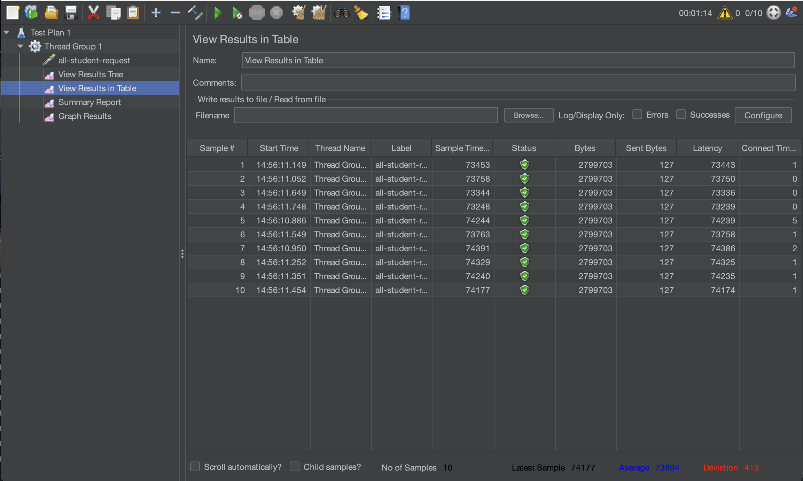
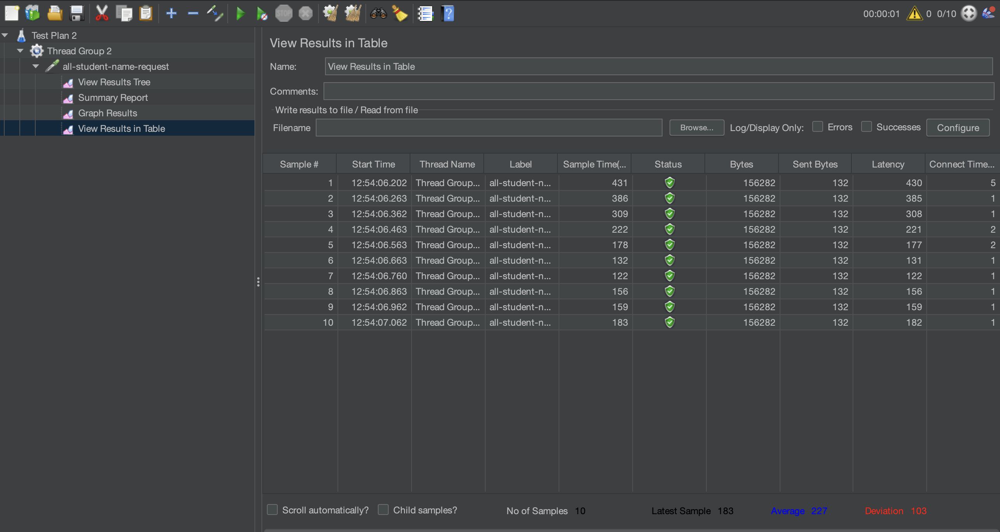
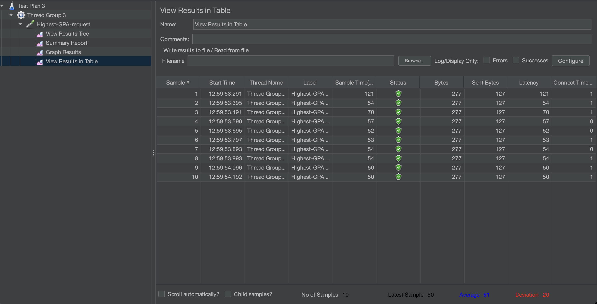

sesudah Optimisasi/refactoring
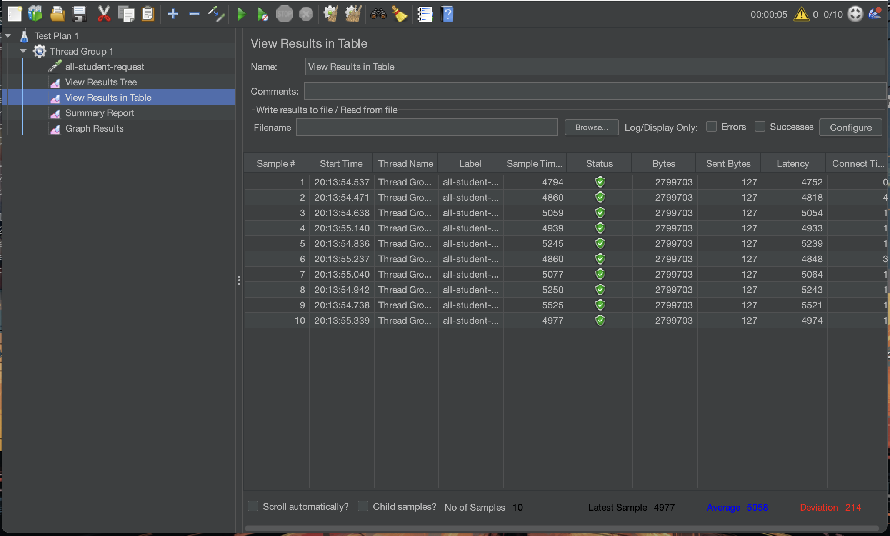
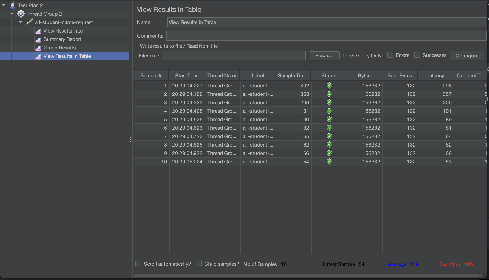
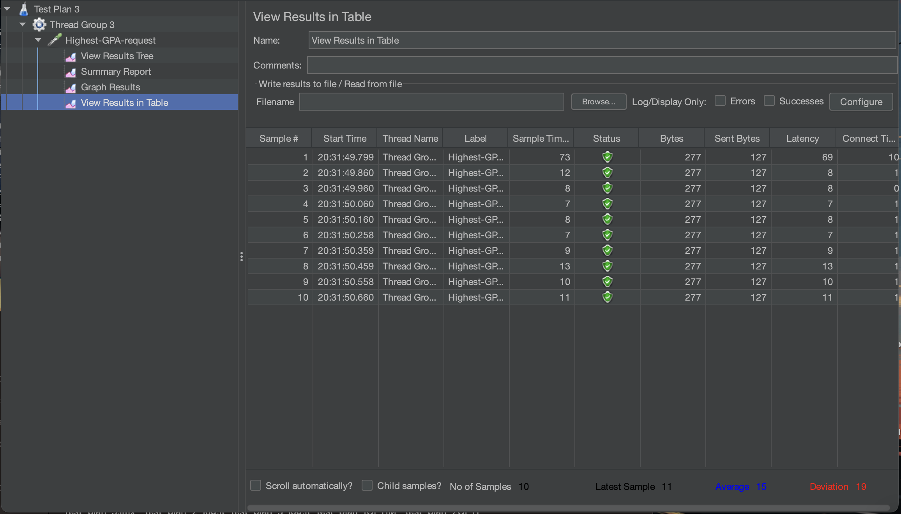

hasil CLI SEBELUM
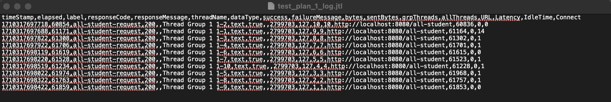
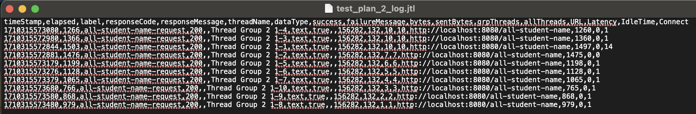
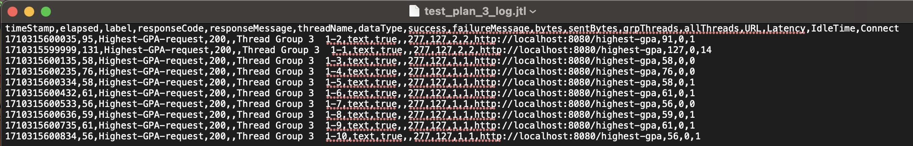

hasil CLI SESUDAH
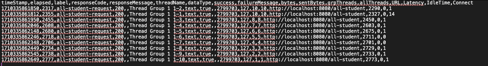
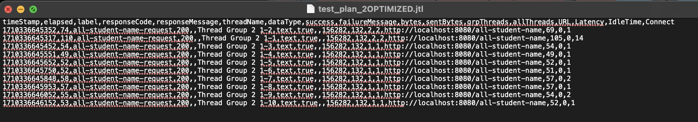
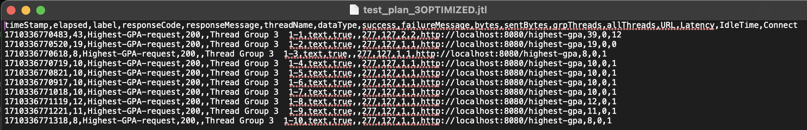

Jika dibandingkan dengan sebelum dan sesudah optimisasi, terdapat perbedaan yang cukup signifikan. Sebelum optimisasi, waktu yang dibutuhkan lumayan lama terutama pada all-student-request, sedangkan setelah optimisasi, waktu yang dibutuhkan sangat lebih cepat. Hal ini menunjukkan bahwa optimisasi yang dilakukan berhasil mengurangi waktu yang dibutuhkan untuk menampilkan data di setiap endpoint.

1. Profiling dengan intellij lebih mendekati mencari apa dan dimana titik paling lemah dalam aplikasi yang sudah dibuat, Sedangkan Jmeter lebih kepada mencari berapa banyak request yang bisa di handle oleh aplikasi yang sudah dibuat, dan apakah response sudah mencukupi kriteria yang diinginkan.
2. Profiling membantu saya dalam menemukan weakest link method pada aplikasi yang sedang dibuat, dengan informasi seperti time dan memeory allocation, informasi ini sangat membantu dalam mengarahkan cara optimisasi yang paling efektif.
3. Iya, profiler sangat membantu saya dalam menganalisa bottleneck pada kode saya, dengan profiler saya bisa mengetahui method mana yang paling banyak memakan waktu dan memory, sehingga saya bisa fokus untuk mengoptimisasi method tersebut.
4. Tantangan utama saya dalam performance testing merupakan menganalisa tiap metode dan runtime yang ada setelah mencoba endpoint, terkadang banyak informasi dan perlu bantuan dari UI untuk mengetahui apa yang penting untuk dicerna.
5. Benefit utama dari profiler intellij adalah pastinya highlight method mana yang paling memakan waktu dan memory, sehingga kita bisa fokus untuk mengoptimisasi method tersebut. Selain itu, profiler juga memberikan informasi yang sangat detail mengenai method yang sedang dijalankan, sehingga kita bisa mengetahui apa yang sebenarnya terjadi dan yang melambati aplikasi kita. Tetapi juga seberapa sering metode itu disebut dan apakah worth untuk dioptimisasi.
6. Ada banyak faktor yang bisa memengaruhi Jmeter seperti versi OS, JVM, dan things of that nature. Solusi yang dipikirkan bisa seperti mengoutsource aplikasi untuk dijalankan di server yang lebih kuat, atau mungkin memakai environment yang stabil seperti sebuah container atau cloud service.
7. Setelah menganalisa running time dari suatu endpoitn, saya akan memakai profiler untuk mencari tahu apa yang sedang membottleneck endpoint itu baik di layer service atau layer lainya, dengan ini saya mencari tahu bottleneck dari semua aspek aplikasi yang sedang dibuat. Di sini juga fungsinya unit test untuk memastikan bahwa fungsionalitas tidak berubah dari refactoring yang dilakukan.